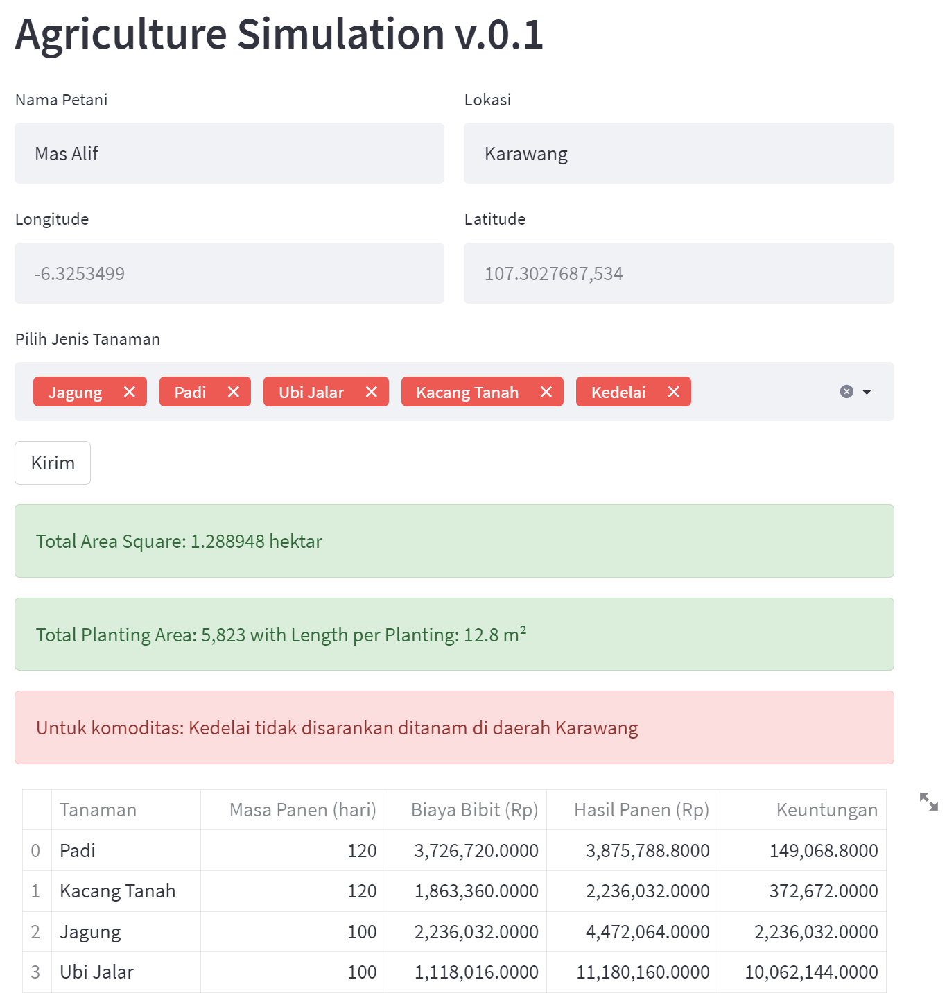
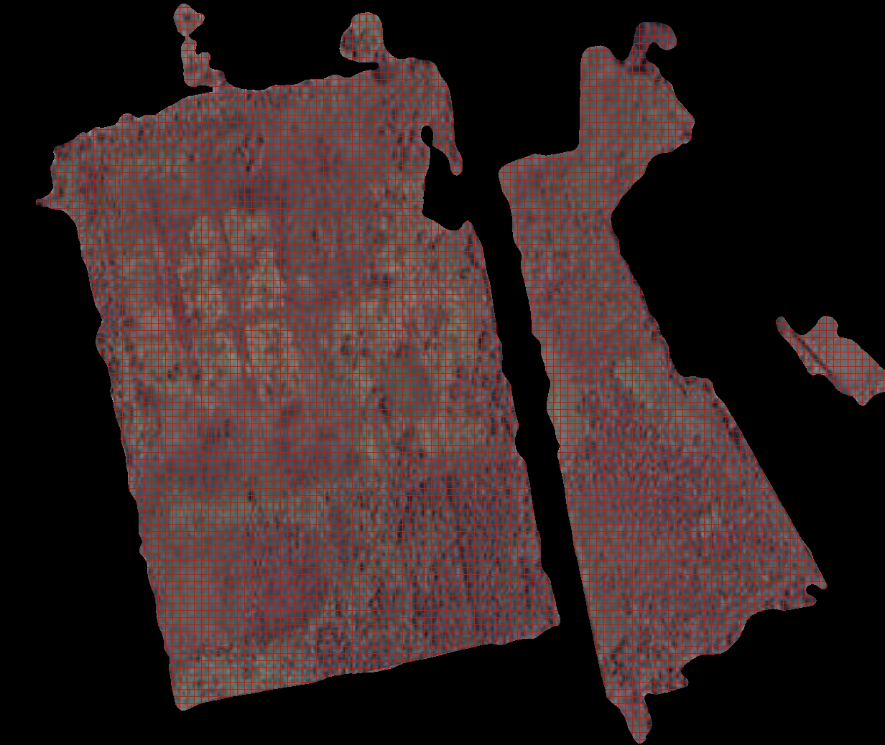

# AgriSim
Lomba Teknik Kimia ttg 5.0 Tech in Eco Culture

# Interface

# Result Segmentation

# Tasking Handler
"Heru"
- [X] Membuat program scraping data komoditas pertanian harga jual dan lokasi komoditas pertanian
- [X] Membuat program scraping data komoditas pertanian harga perawatannya

"Alif"
- [X] memetakan segmentasi lahan yang bisa ditanami
- [X] memetakan grid lahan
- [X] Implementasi pemodelan streamlit
- [] menggunakan karakteristik tanah yang sudah diketahui untuk mengatur kurang cocoknya ditanam suatu jenis komoditas misalnya menggunakan metode klasifikasi [post-poned]